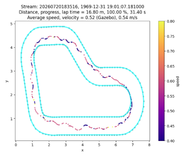

# Autonomous Car via Reinforcement Learning — AWS DeepRacer

Training a car to complete a track in simulation using reinforcement learning.

## How this works

Any RL setup has a few core pieces: an **agent**, an **action space** (the moves the agent can choose from), a **state space** (what state those actions land it in), and a **reward function** (which scores how good that state is).

Here's the loop. A CNN, trained using PPO, starts with random weights and outputs a probability distribution over the action space — random at first, since the weights are random. The agent samples an action from that distribution. The simulator (Gazebo, in our case) executes it and returns the resulting state. The reward function scores that state. The model then updates its weights based on the reward, so better actions become more likely next time. Repeat, thousands of times, and the distribution stops being random.

For this project, there were three real levers to pull:
- **Reward function** — has the most control over learning
- **Action space** — what physical moves are even possible
- **State space** — what the agent perceives

We ended up changing the first two.

## Iteration log

**v1 — AWS's default reward function.**
Reward climbed to ~133, but 0% success — car played it safe, stayed centered, never finished a lap.

**v2 — added a progress reward and a completion bonus.**
Reward jumped to ~493. Still 0% success. Turned out the reward function rewarded *absolute* progress every step, so the agent could rack up huge reward just by parking itself somewhere decent and letting time pass — reward hacking, not learning to finish.

**v3 — reward progress *rate* instead of absolute progress.**
Reward ~443, and now 3/3 evaluation laps hit 100% completion. But each one had exactly one off-track moment along the way. Pulled the raw trace data and found all the off-track events landed on the same (x, y) coordinates across multiple episodes — one specific turn, not random bad luck. Steering was pinned at the max 30° through that whole section, speed locked at 0.6 (the only speed available). Conclusion: the turn was tighter than what 30°/0.6 could physically pull off — not a reward problem, an action space problem.

**v4 — added a slower speed option (0.4) paired with max steering.**
Reward ~471, 3/3 laps at 100% completion, zero off-track events, zero resets. Clean laps. Lap time even dropped a bit (~30s vs v3's ~34s).

## What this actually taught me

- Reward going up doesn't mean the agent is learning what you think it's learning — it's learning exactly what you rewarded, which isn't always the same thing (v1→v2).
- The action space is a hard ceiling. No amount of reward tuning fixes a turn the car is physically incapable of making (v3→v4).
- This is trained entirely on simulated camera input — real-world deployment would hit a sim-to-real gap this project doesn't address.

## Demo

| v3 — 1 off-track event | v4 — clean laps |
|---|---|
|  |  |

## Structure
- `reward_functions/` — versioned reward function code
- `configs/` — versioned action space configs
- `results.md` — raw metrics per version